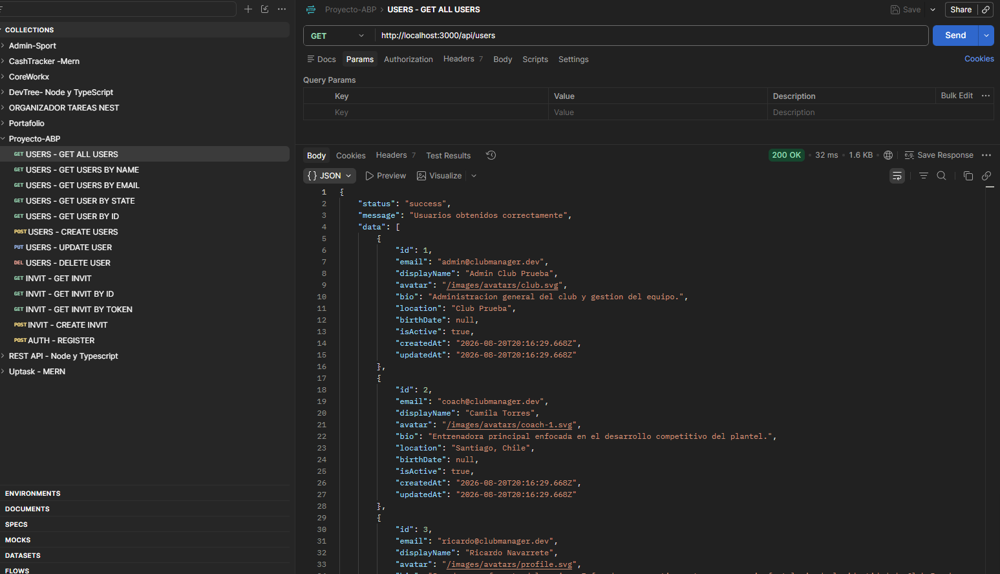
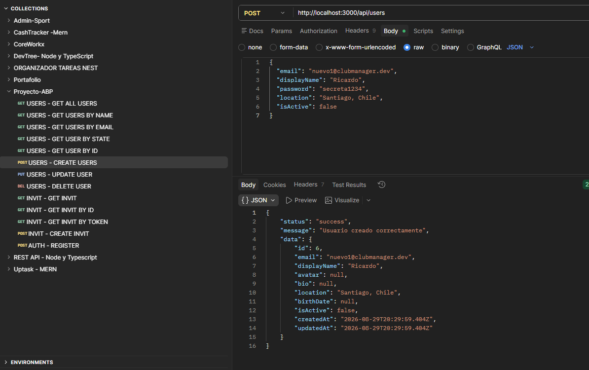
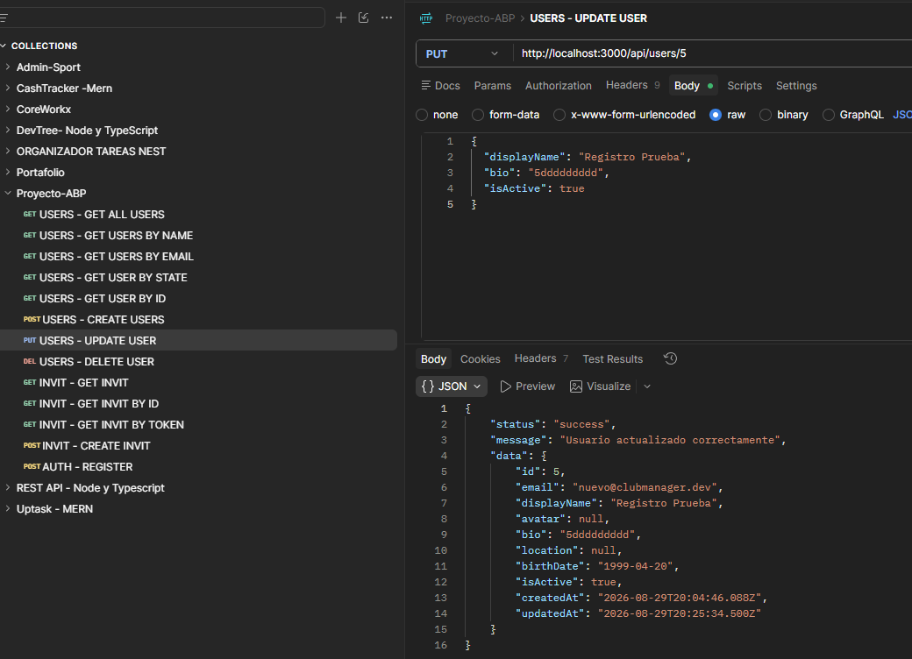
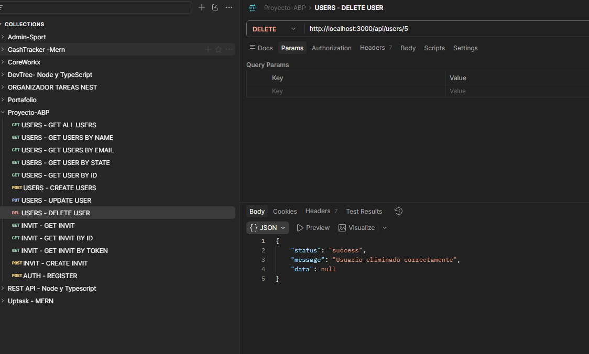
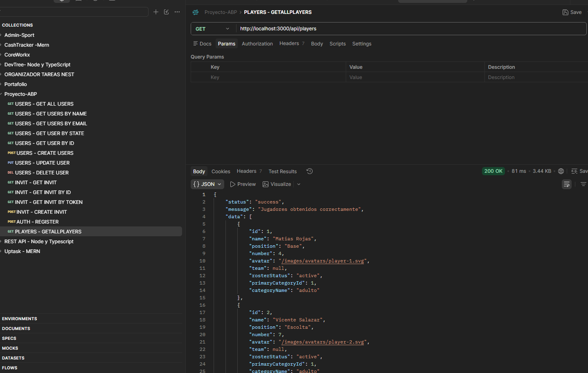
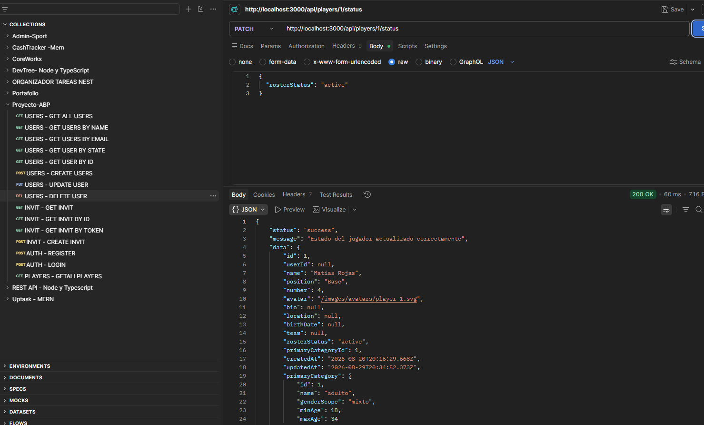
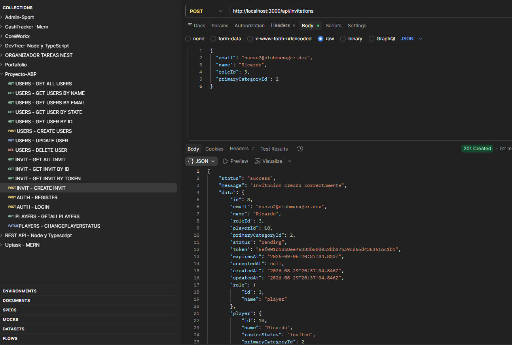
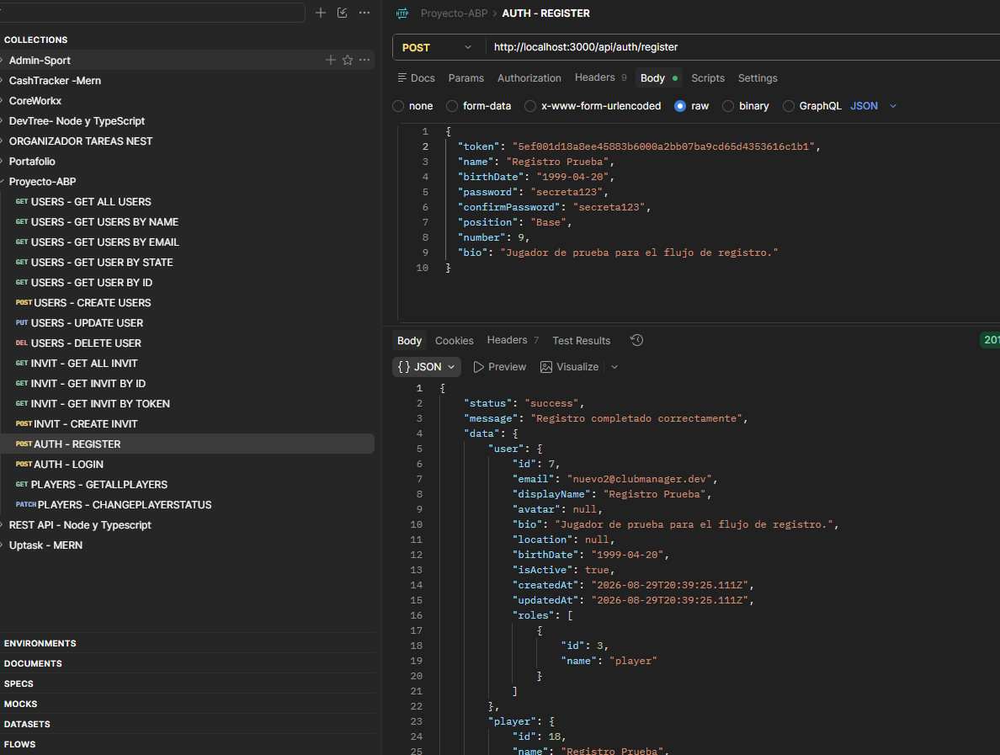
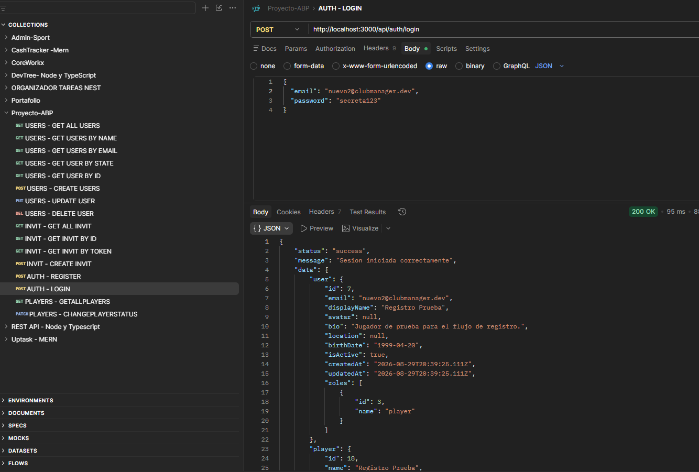

# ClubManager

Repositorio: `https://github.com/RicardoNavarreteDev/clubmanager-ABP-FINAL`

Aplicacion web y backend construidos con `Node.js`, `Express` y `PostgreSQL` para la entrega academica del proyecto final ABP. El sistema modela la gestion de un club deportivo con vistas renderizadas, acceso a datos con `Sequelize`, flujos de invitacion para nuevos usuarios y una API modular que sigue creciendo hacia autenticacion y paneles por rol.

## Descripcion

Esta version incluye:

- servidor Express funcional con `ES Modules`
- vistas con `express-handlebars`
- archivos estaticos servidos desde `public/`
- persistencia simple en `logs/log.txt` para `/status`
- conexion real a `PostgreSQL`
- migraciones con `Umzug`
- modelos y relaciones con `Sequelize`
- arquitectura modular por dominio en `src/modules/`
- API REST para `users`, `players`, `invitations` y `auth`
- flujo real de invitaciones para el registro de jugadores

## Requisitos

- Node.js 18 o superior
- npm
- PostgreSQL
- Git

## Instalacion

1. Clonar el repositorio.
2. Instalar dependencias:

```bash
npm install
```

3. Crear el archivo `.env` a partir de `.env.example`.
4. Crear la base de datos en PostgreSQL.
5. Ejecutar migraciones:

```bash
npm run db:migrate
```

## Configuracion

Variables principales:

```env
PORT=3000
DB_HOST=localhost
DB_PORT=5432
DB_NAME=clubmanager
DB_USER=clubmanager_app
DB_PASSWORD=change_me
APP_DEMO_MODE=true
```

Flags de lectura desde base de datos:

```env
DB_READ_CATEGORIES=true
DB_READ_PLAYERS=true
DB_READ_CHAMPIONSHIPS=true
DB_READ_MATCHES=true
DB_READ_TRAININGS=true
DB_READ_PLAYER_CHAMPIONSHIPS=true
DB_READ_INVITATIONS=true
DB_READ_USERS=true
DB_READ_ROLES=true
DB_READ_PROFILE=true
DB_PROFILE_USER_ID=3
```

Si alguno de esos flags esta en `false`, el modulo correspondiente puede seguir leyendo desde JSON o desactivar la lectura segun el caso.

`APP_DEMO_MODE=true` conserva los datos de muestra para las cuentas seed de `Club Prueba`. Los clubes creados desde la landing comienzan siempre con un dashboard vacio. Usa `APP_DEMO_MODE=false` para ocultar la muestra en toda la instalacion. La instalacion admite un club en esta etapa.

## Ejecucion

Modo desarrollo con reinicio automatico:

```bash
npm run dev
```

Modo normal:

```bash
npm start
```

## Scripts

- `npm run dev`: levanta el servidor con `nodemon`.
- `npm start`: levanta el servidor con Node.js.
- `npm run db:migrate`: aplica migraciones pendientes.
- `npm run db:migrate:undo`: revierte la ultima migracion aplicada.

## Arquitectura

El proyecto usa una arquitectura modular por dominio con capas internas livianas.

- `src/modules/`: organiza el codigo por feature o dominio.
- `*.web.routes.js` y `*.web.controller.js`: rutas y controladores que renderizan HTML.
- `*.api.routes.js` y `*.api.controller.js`: rutas y controladores que responden JSON.
- `*.service.js`: acceso a datos y logica reutilizable del dominio.
- `*.validation.js`: validaciones de entrada.
- `src/models/`: modelos Sequelize.
- `src/database/`: migraciones, seeds y utilidades de base de datos.
- `src/shared/`: utilidades compartidas, como lectura de JSON y respuestas API.

El entrypoint real del servidor es `src/server.js` y la configuracion de Express vive en `src/app.js`.

## Estructura del proyecto

```text
Proyecto-ABP-M6/
├── logs/
│   └── log.txt
├── public/
│   ├── css/
│   ├── images/
│   └── js/
├── src/
│   ├── app.js
│   ├── server.js
│   ├── config/
│   ├── database/
│   ├── middlewares/
│   ├── models/
│   ├── modules/
│   │   ├── auth/
│   │   ├── championships/
│   │   ├── categories/
│   │   ├── events/
│   │   ├── home/
│   │   ├── invitations/
│   │   ├── matches/
│   │   ├── player-championships/
│   │   ├── players/
│   │   ├── posts/
│   │   ├── profile/
│   │   ├── roles/
│   │   ├── status/
│   │   ├── trainings/
│   │   └── users/
│   ├── shared/
│   └── views/
├── .env.example
├── package.json
└── README.md
```

## Rutas web principales

- `/`: landing publica.
- `/crear-club`: alta del club y del administrador fundador.
- `/login`: inicio de sesion.
- `/dashboard`: panel principal autenticado.
- `/status`: estado del servidor y escritura en `logs/log.txt`.
- `/jugadores`: vista de jugadores.
- `/eventos`: vista de partidos y entrenamientos.
- `/campeonatos`: vista de campeonatos.
- `/campeonatos/nuevo`: alta de campeonatos para admin y coach.
- `/gestion/categorias`: alta y listado de categorias.
- `/gestion/partidos/nuevo`: alta de proximos partidos.
- `/perfil`: vista de perfil del usuario cargado.

Ejemplo de respuesta en `/status`:

```json
{
  "status": "ok",
  "message": "Servidor funcionando"
}
```

## API REST disponible

### Users

- `GET /api/users`
- `GET /api/users/:id`
- `POST /api/users`
- `PUT /api/users/:id`
- `DELETE /api/users/:id`

Nota:
`POST /api/users` y `DELETE /api/users/:id` se mantienen para pruebas administrativas del backend. El administrador fundador se registra publicamente al crear la instalacion del club; los usuarios posteriores ingresan mediante invitaciones y registro por token.

Filtros disponibles:

- `email`
- `displayName`
- `isActive`

### Players

- `GET /api/players`
- `GET /api/players/:id`
- `PUT /api/players/:id`
- `PATCH /api/players/:id/status`

Filtros disponibles:

- `name`
- `primaryCategoryId`
- `rosterStatus`

### Invitations

- `GET /api/invitations`
- `GET /api/invitations/:id`
- `GET /api/invitations/token/:token`
- `POST /api/invitations`
- `PATCH /api/invitations/:id/status`

Filtros disponibles:

- `email`
- `roleId`
- `status`

### Auth

- `POST /api/auth/register`
- `POST /api/auth/login`
- `GET /api/auth/me`
- `POST /api/auth/me/avatar`
- `PUT /api/auth/me/profile`
- `PUT /api/auth/me/email`
- `PUT /api/auth/me/password`

### Feed social

- `GET /api/feed`
- `POST /api/feed`
- `POST /api/feed/:postId/likes`
- `POST /api/feed/:postId/votes`
- `POST /api/feed/:postId/comments`
- `POST /api/feed/:postId/comments/:commentId/replies`

El feed persistente admite texto, fotos, encuestas, eventos y avisos. Las fotos aceptan JPG, PNG o WEBP de hasta 4 MB. Los avisos requieren rol `admin` o `coach`.

## Swagger

- `GET /api-docs`

La documentacion OpenAPI se expone con Swagger UI en `/api-docs`.

## Autenticacion

Las rutas privadas usan JWT en el header:

```http
Authorization: Bearer TU_TOKEN
```

Rutas protegidas principales:

- `GET /api/auth/me`
- `POST /api/auth/me/avatar`
- `PUT /api/auth/me/profile`
- `PUT /api/auth/me/email`
- `PUT /api/auth/me/password`
- `GET /api/users`
- `POST /api/users`
- `PUT /api/users/:id`
- `DELETE /api/users/:id`
- `PUT /api/players/:id`
- `PATCH /api/players/:id/status`
- `GET /api/invitations`
- `GET /api/invitations/:id`
- `POST /api/invitations`
- `PATCH /api/invitations/:id/status`

## Flujo real de invitaciones

El flujo actual del proyecto ya no depende del alta libre de usuarios.

1. `admin` puede invitar `admin`, `coach` y `player`.
2. `coach` puede invitar solo `player`.
3. `player` no puede crear invitaciones.
4. Se crea una invitacion con `email`, `name`, `roleId` y, si corresponde, `primaryCategoryId`.
5. Si la invitacion es para rol `player`, se crea una ficha deportiva en estado `invited`.
6. La invitacion genera un `token` unico.
7. El usuario entra al link de registro con ese `token`.
8. `POST /api/auth/register` valida la invitacion y crea la cuenta.
9. El sistema asigna el rol, vincula el `player`, cambia su estado a `active` y marca la invitacion como `accepted`.

Este flujo se ejecuta dentro de una transaccion para mantener consistencia entre `users`, `user_roles`, `players` e `invitations`.

Regla de categoria:

- si `roleId` corresponde a `player`, `primaryCategoryId` es obligatorio
- si `roleId` corresponde a `admin` o `coach`, `primaryCategoryId` puede ir vacio

## Ejemplos de uso

### Crear invitacion para jugador

```http
POST /api/invitations
Content-Type: application/json
```

```json
{
  "email": "jugador.prueba@clubmanager.dev",
  "name": "Jugador Prueba",
  "roleId": 3,
  "primaryCategoryId": 2
}
```

### Registrar usuario con token

```http
POST /api/auth/register
Content-Type: application/json
```

```json
{
  "token": "TOKEN_GENERADO_EN_LA_INVITACION",
  "name": "Jugador Prueba",
  "birthDate": "1999-04-20",
  "password": "secreta123",
  "confirmPassword": "secreta123",
  "position": "Base",
  "number": 9,
  "bio": "Jugador de prueba para el flujo de registro."
}
```

En la aplicacion final, ese `token` no se escribe manualmente. La idea es que viaje en el link que recibe el usuario por correo y que el frontend lo lea automaticamente para habilitar el formulario de registro.

### Iniciar sesion

```http
POST /api/auth/login
Content-Type: application/json
```

```json
{
  "email": "jugador.prueba@clubmanager.dev",
  "password": "secreta123"
}
```

### Obtener sesion autenticada

```http
GET /api/auth/me
Authorization: Bearer TU_TOKEN
```

### Subir avatar del usuario autenticado

```http
POST /api/auth/me/avatar
Authorization: Bearer TU_TOKEN
Content-Type: multipart/form-data
```

Campo esperado:

- `avatar`: archivo `jpg`, `jpeg`, `png` o `webp`

Restricciones:

- tamano maximo de `2 MB`
- se guarda en `public/uploads/avatars/`
- la ruta publica final se persiste en `User.avatar`
- si el usuario tiene ficha `Player`, tambien se sincroniza `Player.avatar`

### Actualizar perfil del usuario autenticado

```http
PUT /api/auth/me/profile
Authorization: Bearer TU_TOKEN
Content-Type: application/json
```

```json
{
  "displayName": "Usuario Actualizado",
  "bio": "Bio actualizada",
  "location": "Santiago",
  "birthDate": "2000-01-02"
}
```

### Actualizar correo del usuario autenticado

```http
PUT /api/auth/me/email
Authorization: Bearer TU_TOKEN
Content-Type: application/json
```

```json
{
  "currentEmail": "user@clubmanager.dev",
  "newEmail": "user.nuevo@clubmanager.dev",
  "confirmEmail": "user.nuevo@clubmanager.dev"
}
```

### Actualizar password del usuario autenticado

```http
PUT /api/auth/me/password
Authorization: Bearer TU_TOKEN
Content-Type: application/json
```

```json
{
  "currentPassword": "secreta123",
  "newPassword": "nuevaSecreta123",
  "confirmPassword": "nuevaSecreta123"
}
```

## Validacion manual recomendada

Rutas web:

- `/`
- `/status`
- `/jugadores`
- `/eventos`
- `/campeonatos`
- `/perfil`
- una URL inexistente para confirmar el `404`

Rutas API:

- `GET /api/users`
- `POST /api/users`
- `PUT /api/users/:id`
- `DELETE /api/users/:id`
- `GET /api/players`
- `PUT /api/players/:id`
- `PATCH /api/players/:id/status`
- `GET /api/invitations`
- `GET /api/invitations/:id`
- `POST /api/invitations`
- `PATCH /api/invitations/:id/status`
- `GET /api/invitations/token/:token`
- `POST /api/auth/register`
- `POST /api/auth/login`
- `GET /api/auth/me`
- `POST /api/auth/me/avatar` exitoso
- `POST /api/auth/me/avatar` con archivo invalido
- `GET /api/does-not-exist` para validar `404` JSON
- `GET /api-docs`

## Registro en archivo plano

La ruta `/status` sigue usando un middleware propio para registrar accesos en `logs/log.txt`.

Ejemplo:

```text
11/8/2026 5:34:11 p.m. - /status
```

## Decisiones tecnicas

- Se mantuvo `src/app.js` separado de `src/server.js` para distinguir configuracion y arranque.
- Se uso `Sequelize` con `PostgreSQL` para trabajar relaciones y migraciones de forma consistente.
- Se migro desde una estructura por capas globales a una arquitectura modular por dominio para escalar mejor.
- Se conservaron vistas renderizadas con `Handlebars` y se sumo una API REST sobre la misma app Express.
- El registro real de jugadores ya no es libre: depende de invitaciones con `token`.
- Se implemento transaccionalidad en el registro para mantener consistencia entre invitaciones, usuarios, roles y jugadores.
- Se incorporo `multer` para manejar upload de avatares con validacion de tipo y tamano.
- Se dejo `Swagger UI` montado en `/api-docs` para documentar la API final.
- Las rutas `/api/*` no encontradas ahora responden `404` JSON consistente.

## Evidencias

### Servidor en funcionamiento


### Ruta principal `/`


### Ruta `/status`


### Registro en `logs/log.txt`


### Pagina 404 personalizada


### Estructura modular del proyecto


### Modulo 7 - GET de usuarios



### Modulo 7 - POST de usuarios



### Modulo 7 - PUT de usuarios



### Modulo 7 - DELETE de usuarios



### Modulo 7 - GET de jugadores



### Modulo 7 - PATCH de estado de jugador



### Modulo 7 - POST de invitaciones



### Modulo 7 - Registro con token



### Modulo 7 - Login



## Estado del proyecto

Actualmente el proyecto ya cuenta con:

- servidor Express funcional
- vistas web operativas
- conexion real a PostgreSQL
- migraciones y seeds
- modelos y relaciones con Sequelize
- CRUD completo para `users`
- modulo API de `players`
- modulo API de `invitations`
- registro y login basados en invitacion
- obtencion de sesion autenticada con `GET /api/auth/me`
- upload de avatar con `POST /api/auth/me/avatar`
- documentacion Swagger disponible en `/api-docs`
- manejo de `404` JSON para rutas API inexistentes
- persistencia simple en archivo plano para `/status`

## Proyeccion

Los siguientes pasos naturales del proyecto son:

- reemplazar el hash temporal por `bcrypt` o `bcryptjs`
- separar experiencia de panel para `admin`, `coach` y `player`
- agregar limpieza de archivos de avatar antiguos al reemplazar imagen
- evolucionar el modelo de una instalacion por club hacia aislamiento multi-club
